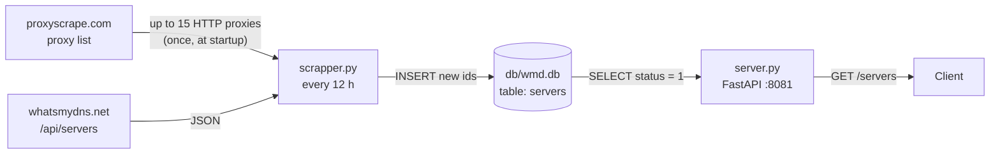

# wmd-servers-scrapper

A small Python service that collects the list of DNS servers used by
[whatsmydns.net](https://www.whatsmydns.net) for its global DNS propagation checks, stores them in
a local SQLite database, and serves them as JSON through a FastAPI endpoint. Use it when you need
the locations and providers of those servers (for example, to plot them on a map or to build your
own propagation checker) without querying the site every time.

The project has two parts that run side by side:

- **The scraper** (`app/scrapper.py`) fetches the server list every 12 hours and adds new servers
  to the database.
- **The API server** (`app/server.py`) reads the database and returns the active servers at
  `GET /servers` on port `8081`.

> **Not affiliated with whatsmydns.net.** This is an unofficial, personal project. See
> [Responsible use](#responsible-use).

## Contents

- [Features](#features)
- [How it works](#how-it-works)
- [Requirements](#requirements)
- [Installation](#installation)
- [Configuration](#configuration)
- [Usage](#usage)
- [Data](#data)
- [Troubleshooting](#troubleshooting)
- [Responsible use](#responsible-use)
- [Security notes](#security-notes)
- [Development](#development)
- [Contributing](#contributing)
- [License](#license)

## Features

- Fetches the whatsmydns.net server list from its JSON endpoint (`/api/servers`). Plain HTTP
  requests with `requests`: no headless browser and no HTML parsing.
- Removes duplicate servers by their `id` before saving them.
- Stores each server's id, coordinates, location, provider, country and status in SQLite.
- Runs once at startup, then every 12 hours (using the `schedule` library in a loop).
- Serves the active servers (`status = 1`) as a JSON array from a FastAPI app on port `8081`,
  with the interactive API docs FastAPI generates by default.
- Includes two systemd units to run the scraper and the API as services.

## How it works



1. **Startup.** `Scrapper()` creates the `servers` table if it does not exist
   (`SqliteConnector.create_tables`) and asks `ProxyScrapper` (`app/proxy.py`) for a proxy list.
2. **Proxy list.** `app/proxy.py` downloads a public proxy table from
   `https://api.proxyscrape.com/proxytable.php?nf=true&country=all` and keeps the first 15
   entries from its `http` section. It is not a DNS proxy; it only supplies proxies for the
   scraper's HTTP requests. The list is fetched once when the scraper starts and is reused for
   every later run.
3. **Scrape.** For each proxy, the scraper requests `https://www.whatsmydns.net/api/servers` and
   reads `id`, `latitude`, `longitude`, `location`, `provider` and `country` from every entry in
   the JSON response. So the same list is fetched once per proxy, and the results are then
   deduplicated by `id`.
4. **Store.** Each server whose `id` is not in the database yet is inserted with `status = 1`.
   Existing rows are not updated.
5. **Schedule.** After the first run, `schedule.every(12).hours` repeats the scrape. The process
   stays in a loop that checks for pending jobs every second.
6. **Serve.** `server.py` starts Uvicorn on `0.0.0.0:8081`. `GET /servers` returns every row
   with `status = 1` as a JSON array.

> **Note on proxies:** the proxies are passed to `requests` as `{"http": "<proxy>"}`, but the
> whatsmydns.net URL is `https://`. `requests` selects a proxy by the URL's scheme, so as the code
> stands the requests are most likely sent directly, not through the proxies.
> <!-- TODO: verify whether the proxy entries from proxyscrape include a port and whether the endpoint still works -->

## Requirements

- **Python 3.9.** The systemd units call `/usr/local/bin/python3.9`, and the committed bytecode
  was built with CPython 3.9. <!-- TODO: verify whether newer Python versions work -->
- Python packages:
  - listed in `requirements.txt`: `loguru`, `requests`, `schedule` (plus `cryptography` and
    `apprise`, which the code does not import);
  - **not** listed in `requirements.txt`, but needed by `server.py`: `fastapi` and `uvicorn`.
- Outbound HTTPS access to `www.whatsmydns.net` and `api.proxyscrape.com`.
- Linux with systemd, if you want to run it as a service.

There is no Docker image, no packaged release and no GitHub Actions workflow.

## Installation

### From source

```bash
git clone https://github.com/t0mer/wmd-servers-scrapper.git
cd wmd-servers-scrapper
python3.9 -m venv .venv
. .venv/bin/activate
pip install -r requirements.txt
pip install fastapi uvicorn   # needed by server.py, missing from requirements.txt
```

Both scripts open the database at the relative path `db/wmd.db`, so **run them from inside the
`app/` directory**:

```bash
cd app
python scrapper.py   # scraper: runs now, then every 12 hours (keeps running)
```

In a second terminal:

```bash
cd wmd-servers-scrapper/app
. ../.venv/bin/activate
python server.py     # API on http://0.0.0.0:8081
```

### As systemd services

The repository ships two units:

| Unit | Runs | Syslog identifier |
|------|------|-------------------|
| `wmd-scrapper.service` | `/usr/local/bin/python3.9 /opt/whatsmydns/app/scrapper.py` | `wmd-scrapper` |
| `wmd-server.service` | `/usr/local/bin/python3.9 /opt/whatsmydns/app/server.py` | `wmd-scrapper` |

Both units use `WorkingDirectory=/opt/whatsmydns/app`, `User=root`, `Restart=always`, start
after `network-online.target`, and log to syslog.

The paths are hard-coded, so either install the project to `/opt/whatsmydns` with the packages in
the system `python3.9`, or edit `WorkingDirectory` and `ExecStart` first (for example, to point at
a virtualenv's `python`).

```bash
sudo git clone https://github.com/t0mer/wmd-servers-scrapper.git /opt/whatsmydns
sudo /usr/local/bin/python3.9 -m pip install -r /opt/whatsmydns/requirements.txt fastapi uvicorn

sudo cp /opt/whatsmydns/wmd-scrapper.service /opt/whatsmydns/wmd-server.service /etc/systemd/system/
sudo systemctl daemon-reload
sudo systemctl enable --now wmd-scrapper.service wmd-server.service
```

Consider changing `User=root` to a dedicated unprivileged user that owns `/opt/whatsmydns/app/db`
(see [Security notes](#security-notes)).

## Configuration

There are no environment variables, CLI flags or config files. All settings are hard-coded:

| Setting | Value | Where |
|---------|-------|-------|
| API listen address | `0.0.0.0` | `app/server.py` (`uvicorn.run`) |
| API port | `8081` | `app/server.py` (`uvicorn.run`) |
| Database path | `db/wmd.db`, relative to the working directory | `app/sqliteconnector.py` (`self.db_file`) |
| Scrape interval | every 12 hours, plus one run at startup | `app/scrapper.py` (`schedule.every(12).hours`) |
| Server list source | `https://www.whatsmydns.net/api/servers` | `app/scrapper.py` (`self.url`) |
| Proxy list source | `https://api.proxyscrape.com/proxytable.php?nf=true&country=all` | `app/proxy.py` (`self.proxies_url`) |
| Number of proxies | 15 | `app/proxy.py` (`proxies_count >= 15`) |
| Service install path | `/opt/whatsmydns/app` | `wmd-*.service` |

To change any of them, edit the file listed.

## Usage

### Scraper

```bash
cd app
python scrapper.py
```

It logs its progress with loguru (to stderr, or to syslog under `wmd-scrapper` when run by
systemd), for example the proxy in use, the number of servers before and after deduplication,
and the total number of active servers in the database. Follow the service logs with:

```bash
journalctl -t wmd-scrapper -f
```

### API

| Method | Path | Description |
|--------|------|-------------|
| `GET` | `/servers` | All servers with `status = 1`, as a JSON array. |
| `GET` | `/docs` | Swagger UI (FastAPI default). |
| `GET` | `/redoc` | ReDoc (FastAPI default). |
| `GET` | `/openapi.json` | OpenAPI schema (FastAPI default). |

```bash
curl -s http://localhost:8081/servers
```

Response (one object per row; the keys are the table's column names):

```json
[
  {
    "id": "dabkemab",
    "latitude": 36,
    "longitude": 140,
    "location": "Chiyoda, Japan",
    "provider": "Kddi",
    "country": "jp",
    "status": 1
  }
]
```

An empty database returns `[]`. If the query fails, the endpoint logs the error and returns
`null` with HTTP 200. See [Troubleshooting](#troubleshooting) for why the committed database
currently has `location` and `provider` the other way round.

## Data

Database: `app/db/wmd.db` (SQLite, created on first run by the scraper). Table `servers`:

| Column | Type | Constraint | Description |
|--------|------|------------|-------------|
| `id` | `text` | `PRIMARY KEY` | whatsmydns.net server id (for example `dabkemab`). |
| `latitude` | `integer` | `NOT NULL` | Latitude. Declared `integer`, but SQLite stores decimals as `REAL`. |
| `longitude` | `integer` | `NOT NULL` | Longitude. Same note as `latitude`. |
| `location` | `text` | `NOT NULL` | City and country, for example `Chiyoda, Japan`. |
| `provider` | `text` | `NOT NULL` | Network operator, for example `Kddi`. |
| `country` | `text` | `NOT NULL` | Two-letter country code, lowercase, for example `jp`. |
| `status` | `integer` | `NOT NULL` | `1` = active. New rows are always inserted with `1`; nothing in the code sets another value. |

The repository includes a pre-filled `wmd.db` with 27 servers.

## Troubleshooting

- **`unable to open database file` in the logs, or `/servers` returns `null`.** The database
  path is relative (`db/wmd.db`). Start both scripts from the `app/` directory, or set
  `WorkingDirectory` in the systemd units to that directory.
- **`ModuleNotFoundError: No module named 'fastapi'` (or `uvicorn`).** They are not in
  `requirements.txt`. Install them with `pip install fastapi uvicorn`.
- **`location` and `provider` are swapped in the API output.** The committed `wmd.db` was
  filled before the fix in commit `edc2545`, so every row has the provider in `location` and the
  place in `provider`. The scraper only inserts ids it has not seen before and never updates
  existing rows, so re-running it does not repair them. Delete `app/db/wmd.db` (or the rows) and
  let the scraper rebuild it.
- **No servers are added.** Check the logs for `Error getting proxies` or `Error Scrapping`. If
  the proxy list cannot be downloaded, the proxy list is empty and the scrape loop has nothing to
  iterate over, so no request is made to whatsmydns.net at all.
- **Servers that disappeared from whatsmydns.net are still returned.** Nothing marks removed
  servers as inactive; rows stay at `status = 1`.
- **Both services log as `wmd-scrapper`.** `wmd-server.service` uses the same
  `SyslogIdentifier`, so filter with `journalctl -u wmd-server.service` to see only the API.

## Responsible use

This project collects data from a third-party website. Automated access to a site may be against
its terms of service. Read and respect whatsmydns.net's terms and any rate limits, keep the
request rate low, and use the data only in ways the site permits. The project is not affiliated
with, endorsed by, or supported by whatsmydns.net.

## Security notes

- The API has no authentication and listens on all interfaces. If you don't need remote access,
  bind it to `127.0.0.1` or put it behind a firewall or reverse proxy.
- The systemd units run as `root`. Prefer a dedicated unprivileged user.
- The scraper is written to pass public proxies from an external list to `requests` (see the note
  in [How it works](#how-it-works)). Public proxies are untrusted; don't route sensitive traffic
  through them.
- Some database queries are built by string concatenation with values that come from the
  scraped data. Treat the scraped data as untrusted input.
- No credentials or API keys are needed or stored.

## Development

Project layout:

```
.
├── app/
│   ├── scrapper.py          # scraper entry point and 12-hour schedule
│   ├── server.py            # FastAPI app, GET /servers on :8081
│   ├── servers.py           # Server model (equality/hash by id, for deduplication)
│   ├── proxy.py             # fetches the public proxy list
│   ├── sqliteconnector.py   # SQLite access (create table, insert, queries)
│   ├── db/wmd.db            # SQLite database (committed)
│   └── __pycache__/         # compiled bytecode (committed)
├── requirements.txt
├── wmd-scrapper.service     # systemd unit for the scraper
├── wmd-server.service       # systemd unit for the API
└── LICENSE
```

Run the scraper and the API locally as shown in [Installation](#from-source). There are no tests,
linters or CI.

Known issues in the repository:

- `app/__pycache__/*.pyc` and `app/db/wmd.db` are committed. Both are generated at runtime and
  would normally be listed in `.gitignore`; the committed database also has swapped
  `location`/`provider` values (see [Troubleshooting](#troubleshooting)).
- `requirements.txt` is unpinned, lists `cryptography` and `apprise` (not imported), and misses
  `fastapi` and `uvicorn`.
- `SqliteConnector.update_server_status` updates a table named `monitored_tunnels`, which does
  not exist in this database.
- `Scrapper.scrap` refers to the module-level `scrapper` variable, so it only works when
  `scrapper.py` is run as a script.

## Contributing

Issues and pull requests are welcome at
[github.com/t0mer/wmd-servers-scrapper](https://github.com/t0mer/wmd-servers-scrapper). Please
keep changes small and describe how you tested them.

## License

This project is licensed under the GNU General Public License v3.0. See [LICENSE](LICENSE).
